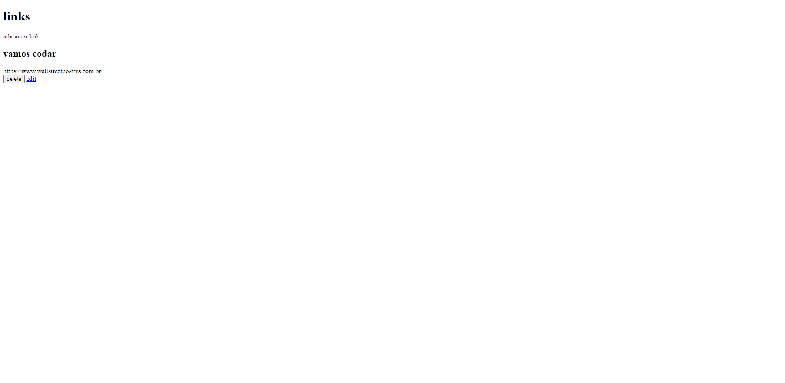
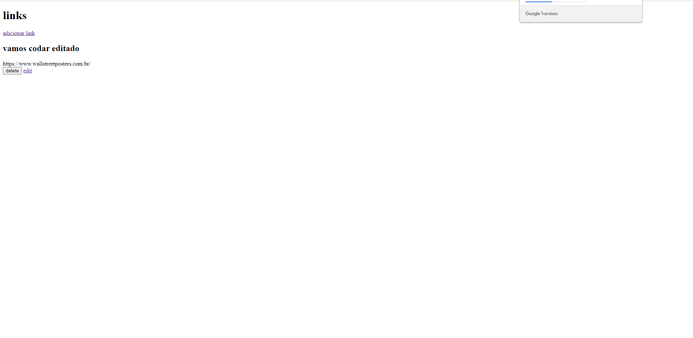

## 💰 Links com node

### Aplicação que permite você adicionar links no site e dar título e descricão a esses links como se fosse uma postagem o sistema te permite editar esses links ou até apagar os mesmos. Todo link fica salvo no banco de dados

## 🖥️ Algumas Telas Do Projeto

## 💻 Tecnologias Usadas

 

## Instalação 

#### Clone o Projeto Com:  

git clone https://github.com/JoaoRicardo2005/links-com-mongo
#### Entre na pasta e instale as dependências com: 
 Yarn
#### Com tudo correto você pode iniciar o servidor com:
yarn start
#### Se você estiver no ambiente de desenvolvimento, poderá usar o servidor de desenvolvimento:
yarn dev 
yarn queue
## Importante 💛

### a aplicação foi totalmente feita por mim joão ricardo mas você pode usar ela do jeito que preferir! seja para estudo,apoio nos estudos ou até para ganhar dinheiro quem sabe rsrs. entre em contato em joaobarbanti7@gmail.com.

